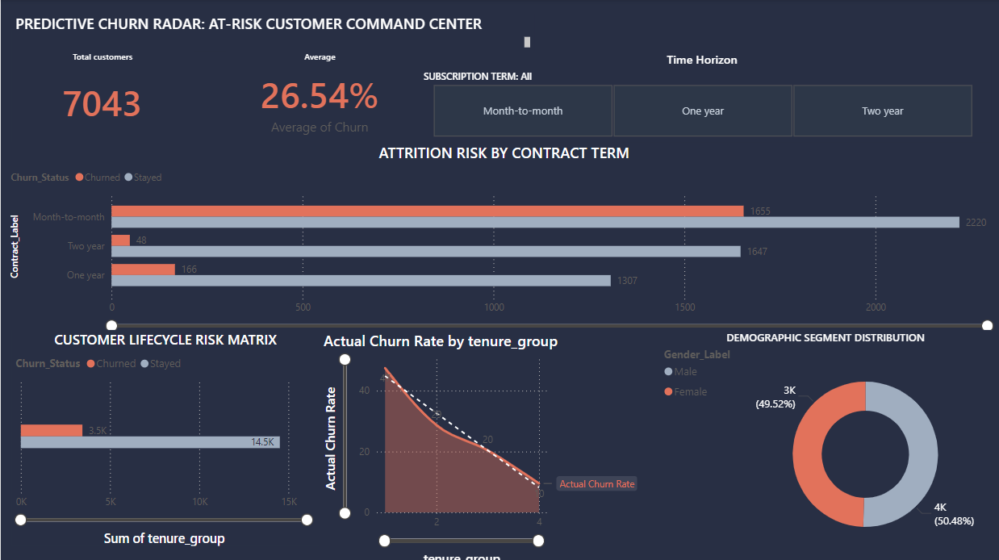

# 🚀 Customer Churn Prediction & Analytics Dashboard


---

# 📌 Project Overview

This project focuses on analyzing customer behavior and predicting customer churn using **SQL, Python, Machine Learning, and Power BI**.

The dashboard provides actionable business insights that help organizations improve customer retention and reduce churn.

---

# 📊 Dashboard Preview

## Executive Dashboard



---

# 🎯 Business Problem

Customer churn is one of the biggest challenges for subscription-based and telecom businesses.

This project helps answer:
- Why are customers leaving?
- Which customer groups are at high risk?
- What factors influence churn?
- How can businesses improve retention?

---

# 💡 Key Features

✅ Customer Segmentation Analysis  
✅ Churn Trend Visualization  
✅ Interactive KPI Dashboard  
✅ Machine Learning Prediction Model  
✅ Retention Insights & Recommendations  
✅ SQL-Based Data Cleaning & Analysis  

---

# 📈 Key KPIs

| KPI | Description |
|------|-------------|
| Churn Rate | Percentage of customers who left |
| Retention Rate | Percentage of retained customers |
| Monthly Revenue Loss | Revenue impacted by churn |
| High Risk Customers | Customers likely to churn |
| Customer Lifetime Value | Estimated customer value |

---

# 🛠️ Technologies Used

| Technology | Purpose |
|------------|---------|
| Python | Data Analysis & Machine Learning |
| Pandas | Data Cleaning & Transformation |
| Scikit-learn | Churn Prediction Modeling |
| SQL | Data Querying & Analysis |
| Power BI | Dashboard Visualization |
| Excel | Data Preprocessing |

---

# 🧠 Machine Learning Models Used

- Logistic Regression
- Random Forest Classifier
- Decision Tree
- XGBoost

---

# 📂 Project Structure

```bash
customer-churn-analysis-dashboard/
│
├── data/
│   ├── raw_data.csv
│   └── cleaned_data.csv
│
├── notebooks/
│   └── churn_prediction.ipynb
│
├── sql/
│   └── churn_queries.sql
│
├── dashboard/
│   └── customer_churn_dashboard.pbix
│
├── screenshots/
│   ├── dashboard1.png
│  
│
├── requirements.txt
├── README.md
└── LICENSE
```

---

# 📊 Dashboard Insights

## 🔹 Key Findings

- Customers with shorter contracts showed higher churn rates.
- Customers using electronic payment methods had higher churn probability.
- Customers with lower tenure were more likely to leave.
- Fiber optic users showed higher churn compared to DSL users.

---

# 📌 Recommendations

✅ Improve onboarding for new customers  
✅ Offer loyalty discounts for long-term customers  
✅ Focus on high-risk customer segments  
✅ Improve customer support experience  
✅ Launch targeted retention campaigns  

---


---
## Open Power BI Dashboard

Open:

```bash
customer_churn_dashboard.pbix
```

---


---

# 👨‍💻 Author

## Sudharshan

Data Analyst | Data Science Enthusiast | Business Intelligence

---

# ⭐ Support

If you like this project, give this repository a ⭐ on GitHub.
